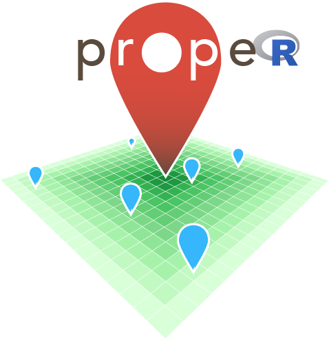

# propeR

**prope** [latin] _verb_
**Definitions:**
1. near, nearby;
2. almost;
3. close by

<p align="center"></p>

## Contents

* [Introduction](#introduction)
* [Software Prerequisites](#software-prerequisites)
* [Installing propeR](#installing-proper)
  * [R installation](#r-installation)
  * [Docker installation](#docker-installation)
* [Running propeR](#running-proper)
  * [Data prerequisites](#data-prerequisites)
  * [Using R](#using-rstudio)
  * [Using Docker](#using-docker)
* [FAQ](#faq)  
* [Acknowledgments](#acknowledgments)  
* [Contributions and Bug Reports](#contributions-and-bug-reports)  
* [Licence](#licence)  


## Introduction

This R package ([propeR](https://github.com/datasciencecampus/proper)) was created to analyse multimodal transport for a number of research projects at the [Data Science Campus, Office for National Statistics](https://datasciencecampus.ons.gov.uk/). This repository is for the installation and use of propeR only, for all OTP graph related guidance, please see [graphite](https://github.com/datasciencecampus/graphite).

## Software Prerequisites

* R and your GUI of choice, such as RStudio, OR
* Docker

## Installing propeR

### R installation

The easiest method is to install direct from this GitHub repository using:

```
library(devtools)
install_github("datasciencecampus/access-to-services/propeR")
```

Failing this, you can pull this repository and install locally using:

```
install("propeR/dir/here")
```

#### R building

If neither method above works. Or you wish to make changes to the package. Then you will need to build the package. Building propeR requires devtools and roxygen2:

```
# R
install.packages("devtools")
install.packages("roxygen2")
```

Then:

```
build("propeR/dir/here")
install("propeR/dir/here")
```

Once you have installed propeR using RStudio you can now [start using it in RStudio.](#using-rstudio)

### Docker installation

For convenience we have created a [Docker](https://www.docker.com/) image for
the [propeR R package](https://github.com/datasciencecampus/access-to-services/tree/develop/propeR).

The propeR R package can be built from the parent directory as follows:

```
cd to/propeR/dir/
docker build . --tag=dsc_proper
```

Or you can build from the [online docker image](https://hub.docker.com/u/datasciencecampus), using:

```
docker run datasciencecampus/dsc_proper:1.0
```

See [Dockerfile](Dockerfile) for more information and dependencies. Once you have installed propeR using Docker you can now [start using it in Docker.](#using-docker)

## Running propeR

Function examples are [available here](https://github.com/datasciencecampus/proper/tree/master/example.md)

### Data prerequisites

All location data (origin and destination) must be in comma separated (CSV) format and contain the following columns:
* A unique ID column
* A latitude column, where data is in decimal degrees (or a postcode column)
* A longitude column, where data is in decimal degrees (or a postcode column)

The CSV file must contain headers, the header names can be specified in **`importLocationData()`**.

### Using RStudio

As with any R package, it can be loaded in an R session using:

```
#R
library(propeR)
```

### Using Docker

Alternatively. If you have installed propeR using Docker you can use Docker to run propeR. Put source and destination `.csv` data in a directory, e.g., `/tmp/data/`. Example data files `origin.csv` and `destination.csv` can be found in `propeR/inst/extdata/`, then:

```
docker run -v /tmp/data:/mnt datasciencecampus/dsc_proper:1.0 'otp.host="XXX.XXX.X.X", fun="pointToPoint", src_file="/mnt/origin.csv", dst_file="/mnt/destination.csv", output.dir="/mnt", startDateAndTime="2019-08-02 12:00:00"'
```

where `otp.host` is your inet address, which can be found using:

```
/sbin/ifconfig |grep inet |awk '{print $2}'

```

Output data will be in `tmp/data/`.


## FAQ

Q: How accurate is the cost calculation in the point to point functions?

>A: The tool currently cannot ingest fare information. Therefore `costEstimate` can be used in the point to point functions. This provides an *estimate* based on the values given in the parameters `busTicketPrice`, `busTicketPriceMax`, `trainTicketPriceKm` and `trainTicketPriceMin`.

Q: How to I stop propeR printing to the R console:

>A: All functions have a parameter called `infoPrint`. This by default is set to `T`, please set to `F` if you want to prevent console printing.

Q: I found a bug!

>A: Please use the GitHub issues form to provide us with the information ([here](https://github.com/datasciencecampus/proper/issues))

### Common errors

Q: Why am I receiving the following error when running propeR?

```
Error in curl::curl_fetch_memory(url, handle = handle) :
  Failed to connect to localhost port 8080: Connection refused
Called from: curl::curl_fetch_memory(url, handle = handle)
```

> A: The OTP server has not been initiated. Please see [graphtie](https://github.com/datasciencecampus/graphite) of this guide.

Q: Why am I receiving the following error when running propeR?

```
Error in paste0(otpcon, "/plan") : object 'otpcon' not found
```

> A: The OTP connection has not been established. Please see [graphtie](https://github.com/datasciencecampus/graphite) of this guide.

## Acknowledgments

* [TransXChange2GTFS](https://github.com/danbillingsley/TransXChange2GTFS)
* [transxchange2gtfs](https://github.com/planarnetwork/transxchange2gtfs)
* [dtd2mysql](https://github.com/open-track/dtd2mysql)
* [OpenTripPlanner](http://www.opentripplanner.org/)
* functions `otpConnect()`, `otpTripTime()`, `otpTripDistance()`, `otpIsochrone()` are modified from Marcus Young's repo [here](https://github.com/marcusyoung/opentripplanner/blob/master/Rscripts/otp-api-fn.R)

## Contributions and Bug Reports

We welcome contributions and bug reports. Please do this on this repo and we will endeavour to review pull requests and fix bugs in a prompt manner.

Built and tested on OS and Windows using R version 3.5.2.

## Licence

The Open Government Licence (OGL) Version 3

Copyright (c) 2018 Office of National Statistics

This source code is licensed under the Open Government Licence v3.0. To view this licence, visit [www.nationalarchives.gov.uk/doc/open-government-licence/version/3](www.nationalarchives.gov.uk/doc/open-government-licence/version/3) or write to the Information Policy Team, The National Archives, Kew, Richmond, Surrey, TW9 4DU.
