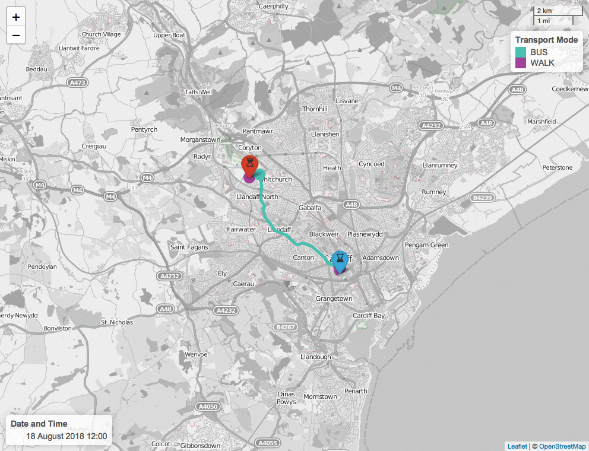

## Contents

* [propeR functions](#proper-functions)
	* [otpConnect](#otpconnect)
	* [importLocationData and importGeojsonData](#importlocationdata-and-importgeojsondata)
	* [pointToPoint](#pointtopoint)
	* [pointToPointLoop](#pointtopointloop)
	* [pointToPointNearest](#pointtopointnearest)
	* [pointToPointTime](#pointtopointtime)
	* [isochrone](#isochrone)
	* [isochroneTime](#isochronetime)
	* [isochroneMulti](#isochronemulti)
	* [isochroneMultiIntersect](#isochronemultiintersect)
	* [isochroneMultiIntersectSensitivity](#isochronemultiintersectsensitivity)
	* [isochroneMultiIntersectTime](#isochronemultiintersecttime)
	* [choropleth](#choropleth)


### propeR functions

  propeR has the following functions:

  | Function | Description |
  |-----------------------|-----------------------------------------|
  | `importLocationData` | Used to generate a dataframe from a CSV file containing origin or destination information. |
  | `postcodeToDecimalDegrees` | Used in `importLocationData()` to convert postcodes to decimal degrees latitude and longitude via API calls (*needs internet access*). |
  | `cleanGTFS` | Used to clean GTFS ZIP folder before OTP graph building. |
  | `isochrone` | Generates a polygon [(isochrone)](https://en.wikipedia.org/wiki/Isochrone_map) around a single origin to calculate journey times to multiple destinations, can output a PNG map, HTML map, and .GeoJSON polygon file. |
  | `isochroneTime` | Same as `isochrone()`, but between a start and end time/date. Output can be an animated GIF image. |
  | `isochroneMulti`  | Same as `isochrone()`, but for multiple origins. A polygon is created for each origin. |
  | `locationValidator` | Used to check the validity of location points by trying to create a small isochrone around the location. FIxes the nearest routable point if there is an error. |
  | `otpConnect` | A core function used to connect to OTP either locally or remotely (i.e. the URL of the generated and hosted OTP graph). |
  | `otpIsochrone` | A core function used to produce an API call to OTP to be used with the propeR isochrone functions. |
  | `otpTripDistance` | A core function used to produce an API call to OTP to find trip distance. |
  | `otpTripTime` | A core function used to produce an API call to OTP to find trip time. |
  | `pointToPoint` | Calculates the journey details between a single origin and destination, can output a PNG map and HTML map. |
  | `pointToPointLoop` | Calculates the journey details between multiple origins and destinations. |
  | `pointToPointNearest` | Calculates the journey details between the nearest (k = 1) destination to each origin using a KNN approach. Can also calculate the second (k = 2), third (k = 3) naearest, and so forth. |
  | `pointToPointTime` | Same as `pointToPoint()`, but between a start and end time/date. Output can be an animated GIF image. |

  Use **`?`** in R to view the function help files for more information, e.g., **`?isochrone`**. Below we will run through each function using the RStudio method, but the help files will help you understand all the parameters that can be changed in each function.


#### otpConnect

```
#R
otpcon <- otpConnect()
```

This function establishes the connection to the OTP server. You will need to specify these in the parameter fields (i.e. `hostname`, `router`, `port`). See **`?otpConnect`** for more information.

#### importLocationData and importGeojsonData

```
#R
originPoints <- importLocationData('PATH/TO/FILE')
```

This loads csv location data into propeR. Specify the unique ID column header using `idcol=""` (default is 'name'), the latitude column using `latcol=""` (default is 'lat'), the longitude column using `loncol=""` (default is 'lon'), and (if needed) the postcode column using `postcodecol=""` (default is 'postcode').

The propeR package comes with some sample CSV data to be used alongside the OTP graph built using the sample GTFS and .osm files on the [github repo](https://github.com/datasciencecampus/propeR). To load this data, run:

```
#R
originPoints <- importLocationData(system.file("extdata", "origin.csv", package = "propeR"))
destinationPoints <- importLocationData(system.file("extdata", "destination.csv", package = "propeR"))
```

The sample data shows an example of data with a latitude, longitude column (recommended) in the origin CSV file, and one with a postcode column only (works, but not recommended) in the destination CSV file. The **`importLocationData()`** function will call a separate function (`postcodeToDecimalDegrees()`) that converts postcode to latitude and longitude.

**Note:** _the column lat\_lon is generated automatically by `importLocationData()` and does not need to be manually entered._

#### locationValidator

```
#R
pointToPoint(output.dir = 'PATH/TO/DIR',
              otpcon = otpcon,
              locationPoints = originPoints,
              modes = 'WALK')
```

This function checks the validity of the origin and destination points. To do this the function tries to create a small isochrone around the location, and if this cannot be created, it will find the closest routable location and overwrite the latitude and longitude. This will the be saved the specified folder as a new file, which needs to be reloaded into propeR. The function is called using the following:

The above will check the validity of the locations for walking routes, including the use of public transport. To check the validity of the location for driving (e.g., town centres) change `modes` to equal `CAR`.

#### pointToPoint

```
#R
pointToPoint(output.dir = 'PATH/TO/DIR',
              otpcon = otpcon,
              originPoints = originPoints,
              originPointsRow = 2,
              destinationPoints = destinationPoints,
              destinationPointsRow = 2,
              startDateAndTime = '2018-08-18 12:00:00',
              modes = 'WALK, TRANSIT',
              mapOutput = F)
```

The most basic function in propeR is find the journey details for a trip with a single origin and destination.

A csv file with the following headers will be output:

| origin | destination | start\_time | end\_time | distance\_km | duration\_mins | walk_distance\_km | walk\_time_mins | transit_time\_mins | waiting\_time_mins | pre_waiting\_time\_mins | transfers | cost | no\_of\_buses | no\_of\_trains | journey\_details |
|---|---|---|---|---|---|---|---|---|---|---|---|---|---|---|---|

The header walk\_time_mins will become drive\_time_mins or cycle\_time_mins if `modes` is changed to `CAR` or `BICYCLE`, respectively. The column for cost will be 'NA' unless `costEstimate = T` is used. The field waiting\_time_mins provides the total waiting time after the first leg of the journey starts (e.g., the first bus/train journey), the field pre_waiting\_time\_mins provides the time between the given `startDateAndTime` and the first leg of the journey (this cannot exceed the `preWaitTime`).

To output a PNG and interactive HTML leaflet map will as shown below, change the parameter `mapOutput` to `T`. For example:

<p align="center"></p>

A GeoJSON of the polyline can be saved using the parameter `geojsonOutput = T`.

Map colours, zoom and other parameters can be specified by the user. See ?pointToPoint for details.

**Note:** _`preWaitTime` is set by default to 15 minutes, any journey after this will not be deemed suitable. Please change `preWaitTime` value to something more appropriate, if needed._

#### pointToPointLoop

```
#R
pointToPointLoop(output.dir = 'PATH/TO/DIR',
              otpcon = otpcon,
              originPoints = originPoints,
              destinationPoints = destinationPoints,
              journeyLoop = 0,
              startDateAndTime = '2018-08-18 12:00:00',
              modes = 'WALK, TRANSIT')
```

This function works in the similar way to the [`pointToPoint()`](#pointtopoint) function, but instead of a single origin and destination, the function loops through all origins and/or destinations provided.

To loop just through the origins, set `journeyLoop` to `1`, to loop just through the destinations, set `journeyLoop` to `2`, and to loop through both, set `journeyLoop` to `0` (default). If you want to loop through each row of origins and route to the same row in destinations, set `journeyLoop` to `3`. Also, you can calculate return leg journeys by setting `journeyReturn` to `T` (default is `F`).

#### pointToPointNearest

```
#R
pointToPointNearest(output.dir = 'PATH/TO/DIR',
              otpcon = otpcon,
              originPoints = originPoints,
              destinationPoints = destinationPoints,
              journeyReturn = F,
              startDateAndTime = '2018-08-18 12:00:00',
              modes = 'WALK, TRANSIT',
              nearestNum = 1,)
```

This function is useful to analyse the travel details between a destination and origin using a K-nearest neighbour (KNN) approached. It is therefore useful in analysing whether the geographically closest destination (or service) is the fastest and most appropriate for an origin.

By default *k* is set to 1, denoted the geographically closest destination. However, the second, third etc nearest destination can be analysed by changing the parameter `nearestNum`. Like `pointToPointLoop` the parameter `journeyReturn` can be used to specify whether the return journey between origin and destination should be also calculated.

#### pointToPointTime

```
#R
pointToPointTime(output.dir = 'PATH/TO/DIR',
              otpcon = otpcon,
              originPoints = originPoints,
              originPointsRow = 2,
              destinationPoints = destinationPoints,
              destinationPointsRow = 2,
              startDateAndTime = '2018-08-18 12:00:00',
              endDateAndTime = '2018-08-18 13:00:00',
              timeIncrease = 20,
              modes = 'WALK, TRANSIT',
              mapOutput = F)
```

This function works in the similar way to the [`pointToPoint()`](#pointtopoint) function, but instead of a single `startDateAndTime`, an `endDateAndTime` and `timeIncrease` (the incremental increase in time between `startDateAndTime` and `endDateAndTime` journeys should be analysed for) can be stated.

Changing `mapOutput` to `T` will save a map for each journey. To save a GIF of the time-series, set `gifOutput` to `T`. For example:

<p align="center"></p>

**Note:** _if left to the default mapZoom tries to set the zoom to the bounding box (`'bb'`) of the origin and destination locations, and the polyline created from the first API call; however, if the first call returns no journey, the map zoom level may not be appropriately set. If this is the case, you may need to manually enter an appropriate mapZoom number (e.g. `mapZoom = 12`)._

#### isochrone

```
#R
isochrone(output.dir = 'PATH/TO/DIR',
              otpcon = otpcon,
              originPoints = originPoints,
              originPointsRow = 2,
              destinationPoints = destinationPoints,
              startDateAndTime  = '2018-08-18 12:00:00',
              modes = 'WALK, TRANSIT',
              isochroneCutOffMax = 90,
              isochroneCutOffMin = 30,
              isochroneCutOffStep = 30,
              mapOutput = F,
              geojsonOutput = F)
```

Instead of a single origin to a single destination, the isochrone function works by taking a single origin and computing the maximum distance from this origin within specified cutoff times. This means that the travel time to multiple destinations can be analysed through a single OTP API call.

A tabular output will show the travel time (in minutes) for each destination by appending the travel time to the destination from the origin to the original destination csv file. This is then saved to the specified `output.dir`.

A map can also be saved by usingn `mapOutput = T`). For example:

<p align="center"></p>

To save the polygon as a .GeoJSON file into the output folder, change `geojsonOutput` to `T`.

#### isochroneTime

```
#R
isochroneTime(output.dir = 'PATH/TO/DIR',
              otpcon = otpcon,
              originPoints = originPoints,
              originPointsRow = 2,
              destinationPoints = destinationPoints,
              startDateAndTime = '2018-08-18 12:00:00',
              endDateAndTime = '2018-08-18 13:00:00',
              timeIncrease = 20,
              isochroneCutOffMax = 90,
              isochroneCutOffMin = 30,
              isochroneCutOffStep = 30,
              modes = 'WALK, TRANSIT',
              mapOutput = F)
```

This function is to [`isochrone()`](#isochrone) what [`pointToPointTime()`](#pointtopointtime) was to [`pointToPoint()`](#pointtopoint), i.e., a time-series between a start and end time/date at specified time intervals that produces a table and an optional animated GIF image.

Changing `mapOutput` to `T` will save a map for each journey. To save a GIF of the time-series, set `gifOutput` to `T`. For example:

<p align="center"></p>

**Note:** _if left to the default mapZoom tries to set the zoom to the bounding box (`'bb'`) of the origin and destination locations, and the polygon created from the first API call; however, if the first call returns no journey, the map zoom level may not be appropriately set. If this is the case, you may need to manually enter an appropriate mapZoom number (e.g. `mapZoom = 12`)._

#### isochroneMulti

```
#R
isochroneMulti(output.dir = 'PATH/TO/DIR',
              otpcon = otpcon,
              originPoints = originPoints,
              destinationPoints = destinationPoints,
              startDateAndTime  = '2018-08-18 12:00:00',
              modes = 'WALK, TRANSIT',
              isochroneCutOffMax = 90,
              isochroneCutOffMin = 30,
              isochroneCutOffStep = 30,
              mapOutput = F,
              geojsonOutput = F)
```

This function works similarly to the [`isochrone()`](#isochrone) function; however, it can handle multiple origins and multiple destinations. This is useful when considering the travel time between multiple locations to multiple possible destinations.

A PNG and interactive HTML map can also be saved in the output directory by changing `mapOutput` to `T`. For example:

<p align="center"></p>

In addition, the polygons can be saved as a single .GeoJSON file by changing `geojsonOutput` to `T`.

```
#R
library(propeR)
```
